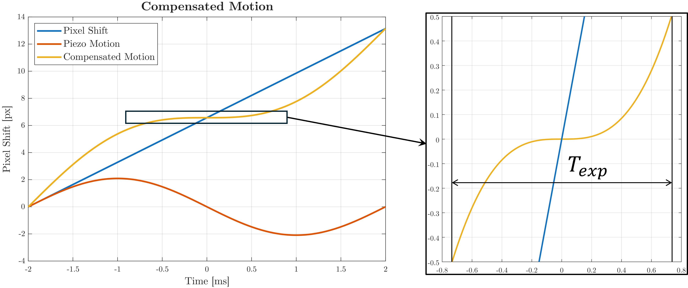

# VLEO Numerical Simulator

A comprehensive numerical simulation and analysis framework for satellite
Forward Motion Compensation (FMC), developed as part of a Master's thesis.
This project integrates image processing, Line-of-Sight modelling and
piezoelectric actuator modelling to evaluate image quality iprovement of a
FMC system.

A FMC system is required to extend the exposure time so that more light can
reach the sensor, while preventing motion blur.

<p align="center">
  
</p>
<p align="center"><em>Figure 1: Image captured at different exposure times without FMC.</em></p>

<p align="center">
  
</p>
<p align="center"><em>Figure 2: Image captured at different exposure times with FMC.</em></p>

## Table of Contents

- [Project Overview](#project-overview)
- [System Requirements](#system-requirements)
- [Installation](#installation)
- [Quick Start Guide](#quick-start-guide)
- [Project Structure](#project-structure)
- [Contact](#contact)
- [References](#references)
- [License](#license)


## Project Overview

The framework is based on three main conceptual blocks:

1. **Image Processing**: Modelling of exposure time dependency of images,
   including shot noise and motion blur simulation.

   - **Shot noise** is modelled as a gaussian distribution starting from
      the photoelectron production rate (i.e., incoming photons on each
      pixel converted to electrons by the photodetector) based on payload
      choice and orbital condition. A modified version of 6SV1.1 [1,2] is
      used ([main.f](src\analysis\radiative_transfer\6SV1.1\main.f)), so
      the executable had to be recompiled. Py6S [2,3] is used as an interface
      to setup and run simulations.
     
   - **Motion blur** is simulated by estimating the pixel shift: how many
     pixels the ground moves over the exposure time. Its effects are
     modelled by using built-in convolution filters in MATLAB.

<p align="center">
  
</p>
<p align="center"><em>Figure 3: Increasing exposure time reduces noise.</em></p>

<p align="center">
  
</p>
<p align="center"><em>Figure 4: Reproducing motion blur.</em></p>

2. **Line-of-Sight Model**: Implementation of a mathematical model used for
   Line-of-Sight estimation, defined as the _intersection of the boresight
   of the satellite's instrument and the Earth's surface_. This model has
   two purposes:

   - Simulate the pixel shift for motion blur.
   - Estimate the pixel shift from position and attitude and determine the
     FMC compensation motion law.
   
   At the moment the model was only validated and is not actively used in
   simulations. For these, a simple nadir pointing of the satellite is
   assumed.

<p align="center">
  
</p>
<p align="center"><em>Figure 5: LoS model.</em></p>

3. **Piezo Motion Model:** Simulation of the required piezo actuator
   sinusoidal motion. This allows to carry out analyses on required
   amplitude vs exposure time/orbital condition and if the actuator can
   fully compensate the motion for the entire exposure time.

<p align="center">
  
</p>
<p align="center"><em>Figure 6: FMC compensation motion.</em></p>

## System Requirements

### MATLAB Configuration
- **MATLAB >= R2025a** with the following toolboxes:
  - Aerospace Blockset
  - Aerospace Toolbox
  - Computer Vision Toolbox
  - Control System Toolbox
  - Image Processing Toolbox
  - Navigation Toolbox
  - Signal Processing Toolbox
  - Simulink

> **Note**: Different versions may work but have not been tested. Some features may require specific toolbox versions.

### Python Configuration
- **Python 3.11** (https://www.python.org/downloads/)
> **Note**: Different versions may work but have not been tested.

### Platform Support
- **Windows**: Full support including radiative transfer calculations via
  6SV1.1
- **Linux/macOS**: Supported except for radiative transfer module. You can
  recompile the executable to make it work on your machine by following the
  steps in the [Installation](#installation) section.

## Installation

### Step 1: Clone or Download Repository

```bash
git clone https://github.com/achille-ballabeni/Satellite-FMC-VLEO.git

cd Satellite-FMC-VLEO
```

### Step 2: MATLAB Project Setup

The repository is managed as a MATLAB project for automatic path configuration:

1. Open MATLAB
2. Navigate to the repository root directory
3. Open `VLEO_numerical_simulator.prj`
4. MATLAB will automatically configure all paths

This ensures all helper functions and models are accessible without manual path management.

### Step 3: Python Environment Setup

For Python-based analysis tools:

1. **Create a virtual environment** (Windows):
   ```console
   python3.11 -m venv env
   ```

2. **Activate the environment**:
   - **Windows**:
     ```console
     .\env\Scripts\activate
     ```
   - **Linux/macOS**:
     ```console
     . env/bin/activate
     ```

3. **Install dependencies**:
   ```console
   pip install -r requirements.txt
   ```

### Step 4: Compile 6SV1.1 (Linux/macOS only)

1. Download the 6SV1.1 source code from any of the two:
   - [link 1](https://rtwilson.com/downloads/6SV-1.1.tar)
   - [link 2](https://gitlab.com/satelligence/6SV1.1)

2. Replace the original _main.f_ file with the one you find in this repo:
   [main.f](src\analysis\radiative_transfer\6SV1.1\main.f)

3. Follow the
   [instructions](https://py6s.readthedocs.io/en/latest/installation.html#alternative-manual-installation:~:text=Installing%206S,-6S)
   to compile it.

4. Copy the compiled executable (`sixsV1.1` or `sixsV1.1.exe`) to `Satellite-FMC-VLEO\src\analysis\radiative_transfer\6SV1.1`

## Quick Start Guide
You can use any of the simulation scripts to quickly run analyses and use
them as a reference to understand how modules interact. From there, more
complex analyses can be derived.

Here's a brief description of each of them.

### `FMC_amplitude_analysis`

**File**: `src/simulations/FMC_amplitude_analysis.m`

Function to investigate how the piezoelectric actuator amplitude changes
based on orbital condition. It reads saved radiative-transfer results from
payload-sensor lookup tables and plots amplitude vs latitude for different
Sun-synchronous orbits beta angles.

**Input Arguments**

- `optics` (string, optional): optics name (default `"TriScape100"`).
- `sensor` (string, optional): sensor name (default `"CMV12000"`).

**Output**

- Figure: amplitude [µm] vs latitude for each beta angle.

**Example Usage**

```matlab
FMC_amplitude_analysis("TriScape100","CMV12000")
```


### `FMC_sinusoid_plots`

**File**: `src/simulations/FMC_sinusoid_plots.m`

Script that computes compensated motion with FMC and draws the sinusoidal
piezo waveform; compares ideal vs measured values.

**Output**

- `plot_compensated_motion` figures.
- Amplitude printed values.

**Example Usage**

```matlab
run FMC_sinusoid_plots
```

### `GEO`

**File**: `src/simulations/GEO.m`

Script to run geometry analysis over beta and latitude grid using
`image_processing.runGEOMETRY` and visualizes the saturation time geometry
through the `image_plotting` class.

**Output**

- Geometry saturation plot.

**Example Usage**

```matlab
run GEO
```

### `MC_los_validation`

**File**: `src/simulations/MC_los_validation.m`

Monte Carlo validation script for Line-of-Sight model over random orbit and
attitude samples.

**Input**

- None (configurable `N` and `seed`).

**Output**

- Batch results and `analysis_tool.runSingleAnalysis("01")` output. Shows
  plots of LoS intersection velocity validation.

**Example Usage**

```matlab
run MC_los_validation
```

### `SNR_FMC_geometry_analysis`

**File**: `src/simulations/SNR_FMC_geometry_analysis.m`

Function to analyze SNR vs exposure time over geometry (latitude and beta).
It computes the SNR for different exposure times, from blur time to
saturation time. It accounts for FMC amplitude saturation.

**Input Arguments**

- `optics` (string, optional, default `"TriScape100"`).
- `sensor` (string, optional, default `"CMV12000"`).
- `full_dataset` (logical, optional, default `false`).

**Output**

- Figure: SNR vs exposure time for selected latitudes.
- Saves `IM_results/SNR_vs_ExposureTime.fig`.

**Example Usage**

```matlab
SNR_FMC_geometry_analysis("TriScape100", "CMV12000", false)
```

### `SNR_FMC_max_value_analysis`

**File**: `src/simulations/SNR_FMC_max_value_analysis.m`

Function to compute the maximum SNR vs latitude and beta considering ideal
exposure time and piezo amplitude saturation conditions. This shows when
the SNR is actuator-limited.

**Input Arguments**

- `optics` (string, optional, default `"TriScape100"`).
- `sensor` (string, optional, default `"CMV12000"`).
- `full_dataset` (logical, optional, default `false`).

**Output**

- Figure: SNR vs latitude across beta values.
- Saves `IM_results/SNR_vs_Latitude.fig`.

**Example Usage**

```matlab
SNR_FMC_max_value_analysis("TriScape100", "CMV12000", false)
```

### `main`

**File**: `src/simulations/main.m`

Core run flow for the simulator: defines orbit, attitude, and calls
`satellite_simulation` and `analysis_tool.runAllAnalyses()`.

**Input**

- None (change parameters in script).

**Output**

- Full batch simulation and analysis reports.

**Example Usage**

```matlab
run src/simulations/main.m
```

## Project Structure

```
Satellite-FMC-VLEO/
└── src/
    ├── analysis/                      # Analysis modules
    │   ├── image_analysis/            # Image processing modules
    │   ├── radiative_transfer/        # Radiative transfer interface
    |   |   ├── 6SV1.1/                # Modified 6SV code and executable
    |   |   ├── lookups/               # Lookup tables of radiative transfer
    |   |   |                            data for preset payloads
    │   │   └── sensors/               # Sensor quantum efficiency
    │   └── simulation_analysis/       # Simulink simulation analysis
    |       └── scripts/               # Analysis scripts
    │
    ├── helpers/                       # Utility and helper functions
    │   ├── data_handling/             # Data I/O
    │   ├── image_processing/          # Image processing related functions
    │   ├── kalman_filter/             # Kalman filtering functions
    │   ├── misc/                      # Miscellaneous utilities
    │   └── orbital_dynamics/          # Orbital dybamics calculations and
    |                                    transformations
    │
    ├── media/                         # Documentation media and figures
    |
    ├── satellite/                     # Satellite and FMC simulation classes
    │
    ├── simulations/                   # Ready-to-use simulation scripts
    │
    └── simulink/                      # Simulink model for LoS validation

```

## Contact

**Author**: Achille Ballabeni

**Institution**: Università di Bologna

**Thesis Title**: Numerical Simulation of Forward Motion Compensation

## References
[1] Second Simulation of a Satellite Signal in the Solar Spectrum vector
code, https://salsa.umd.edu/6spage.html

[2] E. F. Vermote et al. Second Simulation of a Satellite Signal in the
Solar Spectrum - Vector (6SV). 6S User Guide Version 3, November
2006. Laboratoire d’Optique Atmosphérique / 6S User Guide. 2006.
url: https://ltdri.org/files/6S/6S_Manual_Part_1.pdf.

[3] R. T. Wilson. “Py6S: A Python interface to the 6S radiative transfer   model”. In: Computers and Geosciences 51 (Feb. 2013), pp. 166–171.
doi: 10.1016/j.cageo.2012.08.002.

[4] Py6S - A Python interface to 6S,
https://py6s.readthedocs.io/en/latest/index.html#py6s-a-python-interface-to-6s

## License

This project is licensed under the MIT License - see LICENSE file for
details.
